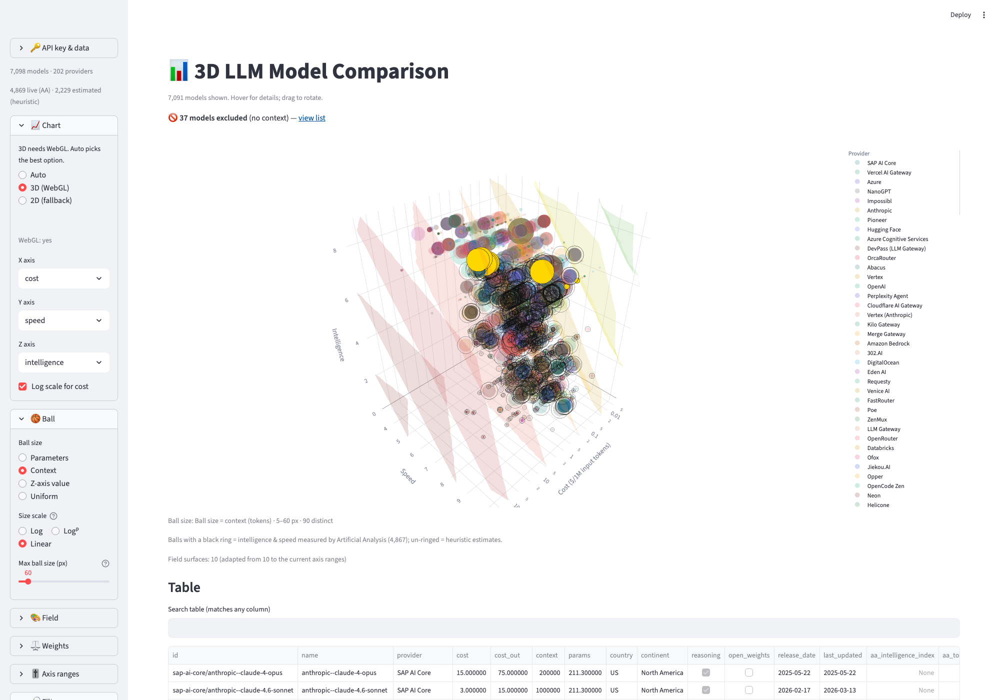
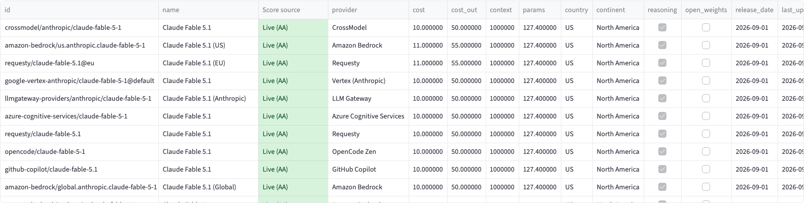
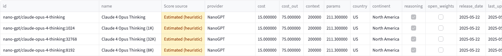

# 3D LLM Model Comparison

Interactive Streamlit app comparing **7,000+ LLMs across 200+ providers** on a 3D chart.

Plot any of these on the axes: **cost, speed, intelligence, context**.



## Quick start

```bash
python3 -m venv .venv && source .venv/bin/activate
pip install -r requirements.txt
streamlit run app.py
```

Open http://localhost:8501

## Live vs. estimated intelligence (and speed)

Every model's **Intelligence (1–10)** comes from one of two places. The app tells you which, everywhere a score is shown:

| | Intelligence & speed source | When |
| --- | --- | --- |
| **Live** | [Artificial Analysis](https://artificialanalysis.ai) index (rescaled: index ÷ 7 → 1–10) | AA key set **and** the model is matched to an AA entry |
| **Estimated** | local heuristic — starts at 6.2, +1.0 reasoning, +0.8 frontier-family name, +0.5 if input cost ≥ $2.50/M, capped at 10 | no key, or no AA match |

Highlighted in **four places**:

- **Chart markers** — a live model gets a thin **black ring** around its ball; estimated models render plain.
- **Hover tooltip** — every ball's hover box shows a **Score source** field (`Live (AA)` / `Estimated (heuristic)` / `User-defined`).
- **Table** — a **Score source** column sits right after *name*: green = live (AA), amber = estimated heuristic, grey = user-defined. A color legend sits under the table.
- **Sidebar** — counts of `live (AA) · estimated (heuristic) · user-defined` update as filters change; without a key it says all scores are estimated.

| Live rows (AA key active) | Estimated rows (no key / no match) |
| --- | --- |
|  |  |

> Because the heuristic caps at 10 while live scores are the raw index ÷ 7, top-of-table (highest-intelligence) rows are often *estimated* even when a key is set — the ring/color is the honest signal of which number to trust.

Custom models you add yourself are marked **User-defined** (grey) — you typed those numbers, so they're neither measured nor guessed.

## Data

| Metric | Source | Auth |
| --- | --- | --- |
| Catalog, pricing, context | [models.dev](https://models.dev) API | keyless, cached 24h |
| Speed & intelligence | [Artificial Analysis](https://artificialanalysis.ai) API | free key (optional) |
| Speed & intelligence (fallback) | local estimates | — |

Models without published parameter counts get an estimate based on intelligence (shown as such in the table).

## Free Artificial Analysis key (optional, recommended)

Makes speed & intelligence live instead of estimated. Free tier: 100 requests/day.

1. Sign up at [artificialanalysis.ai](https://artificialanalysis.ai)
2. Open `https://artificialanalysis.ai/orgs/<your-username>/api-access`
3. Create a key and paste it in the sidebar once — it's saved to `~/.config/model-compare/aa_key` and auto-loaded next launch

## Chart controls

- **Color by** — `Value score` (green = cheap + smart + fast, red = expensive + dumb + slow) or `Provider`
- **Ball size** — parameters, z-axis value, or uniform
- **Chart type** — Auto picks 3D when WebGL works, otherwise falls back to 2D
- **Filters** — search, provider, reasoning-only, open-weights, min context
- **Axes** — swap cost/speed/intelligence/context, log-scale cost

## Things worth knowing

- **Refresh cadence** — models.dev catalog and AA scores are cached locally for 24h (`~/.cache/model_compare_*`); use *Clear cache & reload* in the sidebar to force a refresh.
- **No key = everything estimated** — the chart, table, and sidebar all still work; only the live/estimated labels change.
- **"Live" needs an AA match** — a model shows live only if Artificial Analysis publishes it; newer/obscurer models correctly fall back to the heuristic.
- **Persisted UI state** — sidebar settings are saved to `.app_state.json` (gitignored) and restored on launch; *Reset to defaults* or *Configurations* in the sidebar manage saved setups.
- **Excluded models** — models without a published context length are listed separately under the main table, since context is required to plot them.
